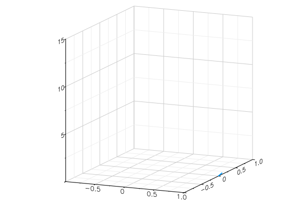

#### MAT100 Multivariable Calculus

## Vector valued functions of one variable

A vector valued function of one variable is a function 

$$ 
\begin{align*}
\mathbf r:D&\to\mathbb R^n\\
t &\mapsto \mathbf r(t)=(r_1(t),r_2(t),\ldots, r_n(t) )
\end{align*}
$$ 

Where $$D\subset \mathbb R$$.

Typical application: 

* $$t$$ represents time, 
* $$\mathbf r(t)$$ the position of an object at time $t$.

We can visualise such functions using **parametric plots** : plot the point $$\mathbf r(t)$$ for each value of $$t$$.

**Examples**

$$\mathbf r:[0,1]\to \mathbb R^2, \quad \mathbf r(t)=(1+t,t)=(1,0)+t(1,1)$$

---

$$c:[0,2\pi]\to \mathbf R^2,\quad \mathbf c(t)=(\cos(t),\sin(t))$$

---

$$c:[0,1]\to \mathbf R^2,\quad \mathbf c(t)=(\cos(2\pi t),\sin(2\pi t))$$

---

$$\mathbf r:[0,4\pi]\to\mathbb R^3,\quad \mathbf r(t)=(\cos t,\sin t,t )$$

