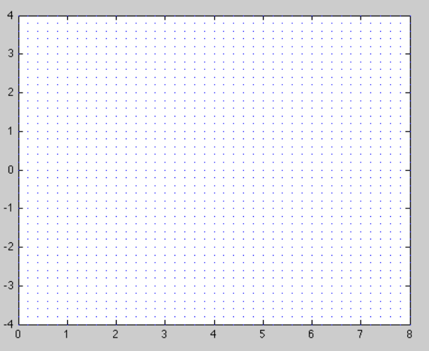

#### M202 Differential Equations, Spring 2018

## Lab 4: Visualisation for DEs

In this lab we will investigate the visualisation of one-dimensional FODEs, including for example exact DEs.

### Basic plots

The MATLAB command `plot` plots points in a two-dimensional figure and
connects them with stright line segments. If $$y$$ is a vector with $$n$$ entries,
then the command `plot(y)` plots the points

$$
	(1,y(1)),
	(2,y(2)),
	(3,y(3)),
	\ldots,
	(n,y(n)).
$$

If $$x$$ is another vector with the same number of entries as $$y$$, then the
command `plot(x,y)` plots the points

$$
	(x(1),y(1)),
	(x(2),y(2)),
	(x(3),y(3)),
	\ldots,
	(x(n),y(n)).
$$

The plot is displayed in a separate window.
For example, the commands:

```
y=[1 0 -1 3 4];
plot(y)
```
yield 


and the commands

```
y=[1 0 -1 3 4]; x=[1 3 7 8 9];
plot(x,y)
```

produce the plot 


---
**Q1** 
Produce two plots of arrays containing the digits of your student ID and your library borrowing barcode.

---

### Plotting graphs of functions

If $$f:D\rightarrow\mathbb R$$ is a function, then the \emph{graph} of this function is
the collection of points $$\{(t,f(t))\,:\,t\in D\}$$ in the plane, where $$D$$ is
the domain of $$f$$.
To display the graph of a function we choose some interval of values for $$t$$,
and plot the points of the graph whose $$t$$-coordinates lie in the given
interval.

In practice we can't plot all of the points of a graph, even if we limit $$t$$ to
a bounded interval, because there are infinitely many points to plot. What we
do is plot a sufficiently dense but finite set of points of the graph and
connect them with very short line segments.

To plot the graph of a function in MATLAB, you need to first define an array
that gives the set of $$t$$-coordinates of the points in the graph. This is the same as the set of step values for times in the forward Euler method, or any other numerical method. Suppose $$D = [a,b]$$. It is a set that looks like

$$
	\{a + kh\,:\, 0 \le k \le (b-a)h\}
	= \{a,a+h,a+2h,\ldots,b-2h,b-h,b\}\,.
$$

We call $$h$$ the step size.
Smaller step sizes produce 'prettier' pictures, but require more computation.

To produce the array of $$t$$ values in MATLAB, we use the colon operator. The
command $$t = a:h:b$$ creates an array $$t$$ with approximately $$(b-a)/h$$ entries
ranging from $$a$$ to $$b$$ with steps of size $$h$$.  Next, the command $$w = f(v)$$
produces the array of corresponding function values (of course MATLAB needs a
specific expression here in place of just $$f(v)$$), and the command
`plot(t,w)` produces the desired plot.

For example, the commands

```
x=-3:0.01:3;
y=-x.^3+2*x.^2+4*x-8;
plot(x,y)
```
(the dot in eg. `x.^2` is reminding matlab to square each element of the array individually, `x^2` will produce an error)
produce the graph of the function $$x\mapsto -x^3+2x^2+4x-8$$, for $$x\in[-3,3]$$.
The plot is:


---

**Q2.** Plot the three functions 

$$f_3:[-1,1]\to \mathbb R, \quad  f(x)= x-\frac{x^3}{3!}$$

$$f_5:[-1,1]\to \mathbb R, \quad  f(x)= x-\frac{x^3}{3!}+\frac{x^5}{5!}$$

$$ f:[-1,1] \to \mathbb R,\quad f(x)=\sin(x)$$ 

on a single set of axes (you will need to use `hold on;` after your first `plot` command to make sure the second `plot` uses the same axes).

---


### Direction fields

Let me now describe how to sketch a direction field for a FODE with MATLAB. We
are going to use the MATLAB functions `meshgrid` and `quiver`.
The command `meshgrid` creates a grid of points $$(t,y)$$, and `quiver` plots little vector arrows at every point, whose directions will be determined by the RHS of the differential equation

$$	y'(t) = f(t,y(t))\,. $$

Consider the following commands:

```
[T Y]=meshgrid(minT:step:maxT, minY:step:maxY);
dY=f(T,Y);
dT=ones(size(dY));
quiver (T,Y,dT,dY);
```

The code does the following:

* `meshgrid` creates a uniformly spaced grid of points in the rectangle (don't we love rectangles?) $$
\{(T,Y): minT \le T \le maxT\,,\quad minY \le Y \le maxY\}$$
and assigns the horizontal coordinates of the points to $$T$$ and
the vertical coordinates to $$Y$$. The spacing is determined by the parameter `step`.
* The command `dY = f(T,Y)` computes the matrix of slopes of
		the vectors attached to each point in the grid.
* `ones` creates a matrix that contains only $$1$$s of the same
		dimension as $$dY$$.
* The vector that the `quiver` command plots at the point
		$$(T,Y)$$ in the grid will be parallel to $$(dT,dY) = (1,dY)$$,
		giving it the correct slope. The command automatically scales
		the vectors so that they do not overlap. Note that this can
		give a distorted impression of the speed that trajectories are
		followed.
		
Consider a DE

$$ y'(t) = \cos(2t) - \frac{y(t)}{t}\,,$$

for $$y:(0,8)\rightarrow\mathbb R$$. 
I'm going to try and plot a direction field for this
DE. The rectangle that I'm going to use is

$$	\{(t,y)\,:\,0\le t\le 8\,, -4\le y\le 4\}\,. $$

We use the code above as a template, and write:

```
[T Y]=meshgrid(0:0.2:4, -4:0.2:4);
dY=cos(2*T)-Y./T;
dT=ones(size(dY));
quiver (T,Y,dT,dY);
```

The code produces the plot:




The problem is with the automatic scaling feature of \emph{quiver}, combined
with the fact that all the vectors in the direction field above have vastly
different lengths.
To fix this, we can scale all the vectors to have unit length, by dividing each one by its length.
Inserting

```
L=sqrt(1+dY.^2);
```
before the `quiver` command, and then changing the `quiver`  command
to

```
quiver(T, Y, dT./L, dY./L)
```
produces 


This one looks OK, but there are still issues to fix. There is too much white space around the direction field and the vectors are overlapping in some places.
Using the pair of commands

```
quiver(T,Y, dT./L,dY./L, 0.5)
axis tight
``` 
produces the much nicer plot


Here the white space is removed with `axis tight` and the little vectors
scaled to half their former length by the optional argument 0.5 to
`quiver`.

Because `quiver` is a plotting command, the regular plotting arguments and
commands can be used in conjunction with quiver.  For example, the commands

```
xlabel 't', ylabel 'y';
title 'Direction field for dy/dt=cos(2t)-y/t';
quiver(T,Y, dT./L,dY./L, 0.5,'r'), axis tight
```

produce the red direction field below:


It is important to keep in mind that these plots are *not* phase
portraits, they are *slope fields* for one-dimensional differential equations (in lectures we distinguished them from 2D vector field phase portraits by using minitangents instead of little arrows).

---
**Q3.** Plot the direction field for 

$$ y'(t) = t^3 - \frac{y(t)}{t}\,,$$

a large enough rectangle and then use it to approximate by-hand solutions satisfying $y(1) = 0$ and $y(1) = 3$.

---

### Contour plots

A contour plot of a function of two variables $$F(x,y)$$ is a plot of level curves of $$F$$, i.e. sets of points satisfying $$F(x,y)=c$$ for some different values of $$c\in\mathbb R$$. In matlab the basic commands are:

```
[X Y]= meshgrid(minX:step:maxX, minY:step:maxY);
contour(X,Y,F(X,Y));
```
This will plot level curves for several different values of $$c$$ which matlab chooses automatically.

For example:

```
[X,Y]=meshgrid(-5:0.2:5, -2:0.2:2);
contour(X,Y, Y.^4+X.^2);
```


To choose particular values of $$c$$ you can specify an optional argument to `contour` listing the values that you want

```
contour(X,Y,Y.^4+X.^2, [1,4,16]);
```


### Direction fields and contour plots

Contour plots can be combined with direction fields to give a more complete picture of generalised solutions to a 1D FODE.  Let me explain with an example.
Consider the FODE

$$	y'(x) = f(x,y(x)) = \frac{4-x}{y^3(x) + 2}\,.$$

Here I've used $$(x,y)$$ instead of $$(t,x)$$ just because we are going to be
plotting the generalised solutions as contours, and so it is helpful to think
of them as set in the plane.
A direction field for this ODE looks like


While the direction field does reveal some general idea of the shape of the
solution, it isn't completely clear what solutions look like.

---
Q4. Verify that $$\psi(y,x)= y^4(x) + 2x^2 - 16x + 8y(x)$$ is a potential function for the exact FODE above.

---
Remember that since it is exact, any solution $$y(x)$$ of the FODE satisfies $$\psi(x,y(x))=c$$ for some constant $$c$$, i.e. *the solutions are contained in level curves of the potential.* This means a contour plot of the potential can give us a much clearer picture of the shape of solutions!


When coupled with a differential equation, these curves are called
*integral curves*. The fact that ODE theory (such as Picard) implies that
they exist is one of the most used facts in all of mathematics.
Each integral curve corresponds to two solutions of the differential equation.
The 'top' of the curve corresponds to an initial $$y$$-value that is greater than $$-2^{1/3}$$, and the `bottom' of the curve corresponds to an initial $$y$$-value that is less than $$-2^{1/3}$$.
Can you explain where this number comes from?

---
**Q5.** Consider the exact FODE from your assignment:

$$ 2tx(t)x'(t)+\cos(t)+x^2=tsin(t) $$

which has a potential function 

$$\psi(t,x)=tx^2+t\cos(t)$$

Plot the slope field for this ODE together with some level curves for the contour on the domain $$[0,5]\times [0,5]$$. For extra fun, try some different domains. For extra extra fun add some forward-Euler solutions to your plot!

---


