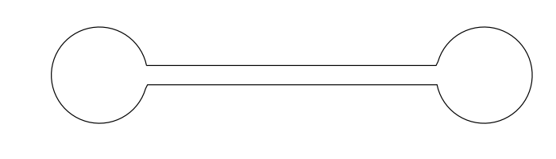

**Current position:** JSPS postdoctoral research fellow at Tohoku University. My host is Professor Shinya Okabe. I'm working on Sobolev gradient flows of geometric functionals like length and total squared curvature. 

I'm interested in geometric variational problems and flows, differential geometry, and global analysis. 

### Preprints

S. Okabe, P. Schrader [Convergence of Sobolev gradient trajectories to elastica,](https://arxiv.org/abs/2107.06504) 2021

P. Schrader, G. Wheeler and V.-M. Wheeler, [On the $$H^1(ds)$$- gradient flow for the length functional,](https://arxiv.org/abs/2102.07305) 2021

### Publications

P. Schrader, [Morse theory for elastica](http://dx.doi.org/10.3934/jgm.2016006). J. Geom. Mech., 8(2):235–256, 2016.

P. Schrader. [Existence of variationally defined curves with higher order elliptic Lagrangians](http://dx.doi.org/10.1016/j.na.2014.11.016). Nonlinear Anal., 115:1–11, 2015.

P. Schrader and L. Noakes. [Conditional extremals in complete Riemannian manifolds](http://dx.doi.org/10.1016/j.na.2011.10.018). Nonlinear Anal., 75(4):2177–2188, 2012.

**Ph.D. thesis**

Schrader, P. J. (2016). [Global analysis of one-dimensional variational problems.](https://research-repository.uwa.edu.au/en/publications/global-analysis-of-one-dimensional-variational-problems)